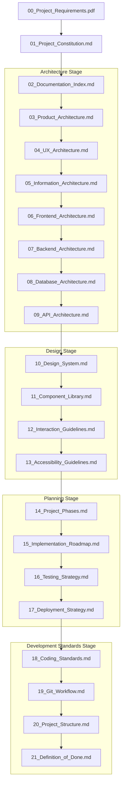

Status: Approved

Version: 1.0

Depends On:
- docs/01_Project_Constitution.md

Blocks:
- docs/Architecture/03_Product_Architecture.md

Author:
Lead Architect

---

# Documentation Index

Welcome to the Documentation Index for the SkillBridge Internship Management Portal (IMP). This document acts as the master register and navigation map for the project's documentation hierarchy. No implementation code may be written until all documents in the hierarchy are drafted, reviewed, and marked as **Approved**.

---

## 1. Documentation Tree
The repository documentation is structured under the `docs/` folder:

```
docs/
├── 00_Project_Requirements.pdf
├── 01_Project_Constitution.md
├── 02_Documentation_Index.md
├── Architecture/
│   ├── 03_Product_Architecture.md
│   ├── 04_UX_Architecture.md
│   ├── 05_Information_Architecture.md
│   ├── 06_Frontend_Architecture.md
│   ├── 07_Backend_Architecture.md
│   ├── 08_Database_Architecture.md
│   └── 09_API_Architecture.md
├── Design/
│   ├── 10_Design_System.md
│   ├── 11_Component_Library.md
│   ├── 12_Interaction_Guidelines.md
│   └── 13_Accessibility_Guidelines.md
├── Planning/
│   ├── 14_Project_Phases.md
│   ├── 15_Implementation_Roadmap.md
│   ├── 16_Testing_Strategy.md
│   └── 17_Deployment_Strategy.md
└── Development/
    ├── 18_Coding_Standards.md
    ├── 19_Git_Workflow.md
    ├── 20_Project_Structure.md
    └── 21_Definition_of_Done.md
```

---

## 2. Document Catalog & Purpose

| ID | Document Name | Purpose / Description |
|:---|:---|:---|
| **00** | [Project Requirements](file:///home/ntirth005/Documents/IMP/docs/00_Project_Requirements.pdf) | The immutable requirements specification provided by Team SkillBridge. |
| **01** | [Project Constitution](file:///home/ntirth005/Documents/IMP/docs/01_Project_Constitution.md) | The governing document for repository rules, tech stack, and workflow rules. |
| **02** | [Documentation Index](file:///home/ntirth005/Documents/IMP/docs/02_Documentation_Index.md) | Master tree index, dependency graph, status tracker, and stage checklists. |
| **03** | Product Architecture | Product flow diagrams, role definitions, and core user-journey states. |
| **04** | UX Architecture | Page wireframe layouts, navigational flows, and desktop/mobile user paths. |
| **05** | Information Architecture | Platform-wide sitemap, file classifications, and metadata attributes. |
| **06** | Frontend Architecture | Next.js layout, context providers, server action usage, routing structures. |
| **07** | Backend Architecture | Security middlewares, authentication flow logic, and background jobs. |
| **08** | Database Architecture | PostgreSQL schema models, primary keys, relationships, and index definitions. |
| **09** | API Architecture | Internal endpoint routes, API schemas, payload validation, and responses. |
| **10** | Design System | HSL color constants, spacing scales, grid setups, and typographic tokens. |
| **11** | Component Library | Reusable component inventories (Button, Input, Badge, Tables, Graphs). |
| **12** | Interaction Guidelines | Hover micro-transitions, loader spinners, modal dialog behavior. |
| **13** | Accessibility Guidelines | WCAG 2.1 AA checklist, keyboard focus rings, screen-reader labels. |
| **14** | Project Phases | Timeline milestones and chronological phase deliverables. |
| **15** | Implementation Roadmap | Specific task lists, step-by-step checklist of features. |
| **16** | Testing Strategy | Setup configurations for unit testing (Jest/Vitest) and e2e testing. |
| **17** | Deployment Strategy | Vercel configurations, production building steps, env configurations. |
| **18** | Coding Standards | ESLint configurations, TypeScript strict options, clean code parameters. |
| **19** | Git Workflow | Standard commit message patterns, branch creation, PR guidelines. |
| **20** | Project Structure | Absolute directory maps, boilerplate scaffolding, absolute import mappings. |
| **21** | Definition of Done | Explicit checklist criteria required before any task is marked completed. |

---

## 3. Dependency Graph
Every document is gated by its preceding document. The following graph illustrates the generation dependencies:



---

## 4. Documentation Status Tracker

| ID | File Path | Version | Status |
|:---:|:---|:---:|:---:|
| **00** | `docs/00_Project_Requirements.pdf` | 1.0 | ✅ Approved |
| **01** | `docs/01_Project_Constitution.md` | 1.1 | ✅ Approved |
| **02** | `docs/02_Documentation_Index.md` | 1.0 | ✅ Approved |
| **03** | `docs/Architecture/03_Product_Architecture.md` | 0.1 | 📝 Draft |
| **04** | `docs/Architecture/04_UX_Architecture.md` | - | ⏳ Pending |
| **05** | `docs/Architecture/05_Information_Architecture.md` | - | ⏳ Pending |
| **06** | `docs/Architecture/06_Frontend_Architecture.md` | - | ⏳ Pending |
| **07** | `docs/Architecture/07_Backend_Architecture.md` | - | ⏳ Pending |
| **08** | `docs/Architecture/08_Database_Architecture.md` | - | ⏳ Pending |
| **09** | `docs/Architecture/09_API_Architecture.md` | - | ⏳ Pending |
| **10** | `docs/Design/10_Design_System.md` | - | ⏳ Pending |
| **11** | `docs/Design/11_Component_Library.md` | - | ⏳ Pending |
| **12** | `docs/Design/12_Interaction_Guidelines.md` | - | ⏳ Pending |
| **13** | `docs/Design/13_Accessibility_Guidelines.md` | - | ⏳ Pending |
| **14** | `docs/Planning/14_Project_Phases.md` | - | ⏳ Pending |
| **15** | `docs/Planning/15_Implementation_Roadmap.md` | - | ⏳ Pending |
| **16** | `docs/Planning/16_Testing_Strategy.md` | - | ⏳ Pending |
| **17** | `docs/Planning/17_Deployment_Strategy.md` | - | ⏳ Pending |
| **18** | `docs/Development/18_Coding_Standards.md` | - | ⏳ Pending |
| **19** | `docs/Development/19_Git_Workflow.md` | - | ⏳ Pending |
| **20** | `docs/Development/20_Project_Structure.md` | - | ⏳ Pending |
| **21** | `docs/Development/21_Definition_of_Done.md` | - | ⏳ Pending |

---

## 5. Current Project Stage
*   Stage: `Architecture Stage`
*   Goal: Draft and approve all architectural specifications (03 to 09).
*   Next Gate: Transition to `Design Stage` on approval of `09_API_Architecture.md`.

---

## 6. Architecture Approval Checklist
Before any document is transitioned from `Draft` to `Approved`, the AI Architect must check:
- [x] Alignment with **Project Constitution** constraints (No additional roles/modules).
- [x] Correct dependencies declared in metadata block.
- [x] Compliance with WCAG 2.1 AA guidelines (for UX/Design/Component specs).
- [x] No code generation attempted before Document 21 is marked Approved.
