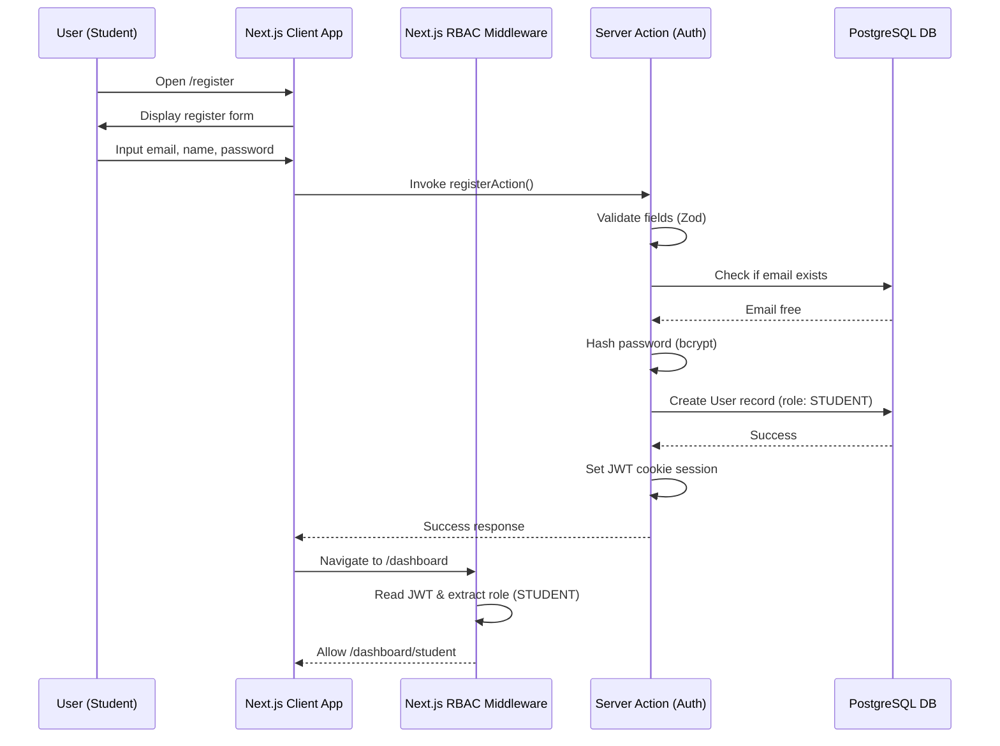
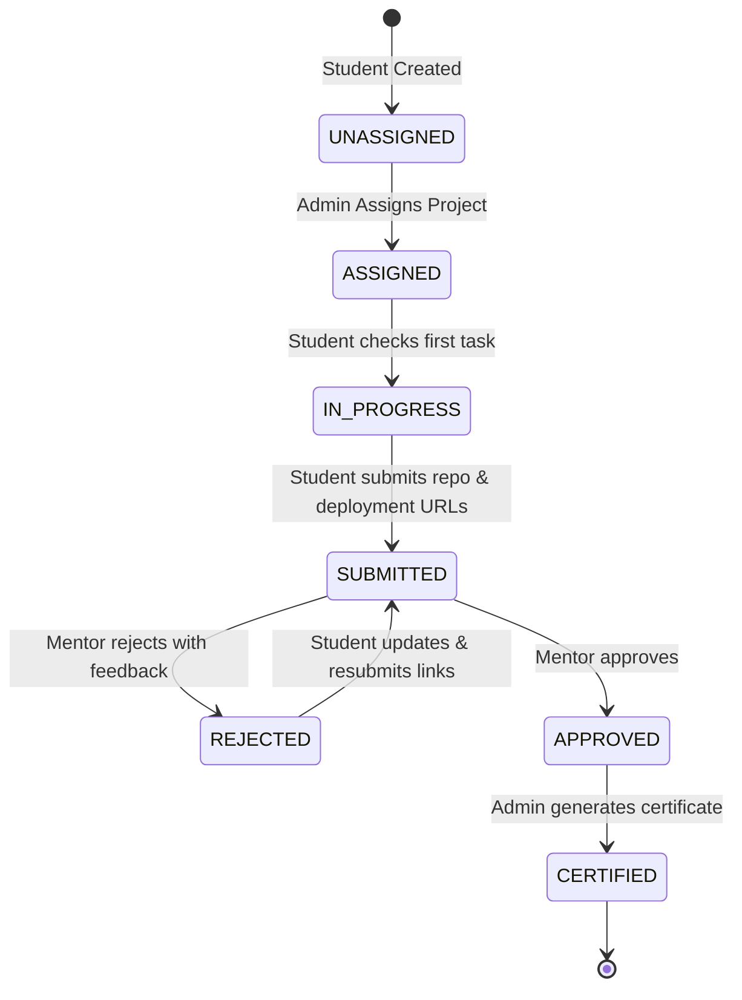
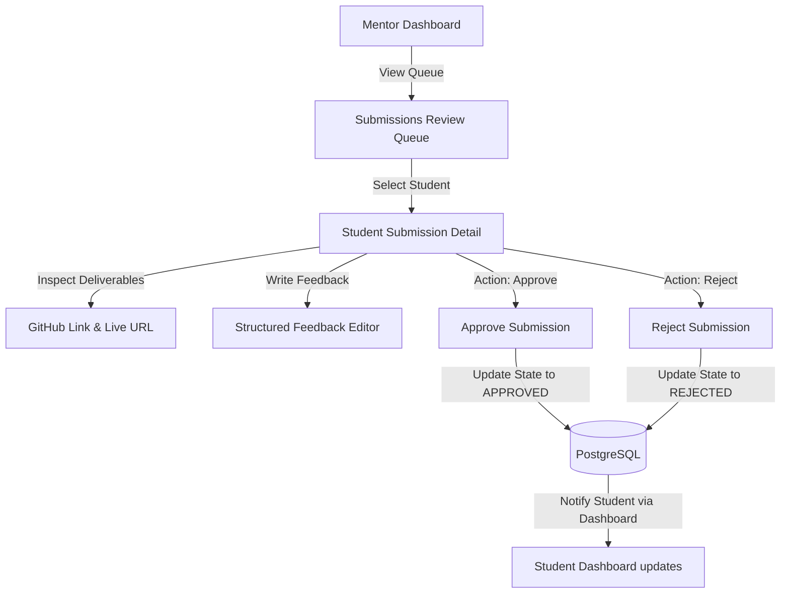
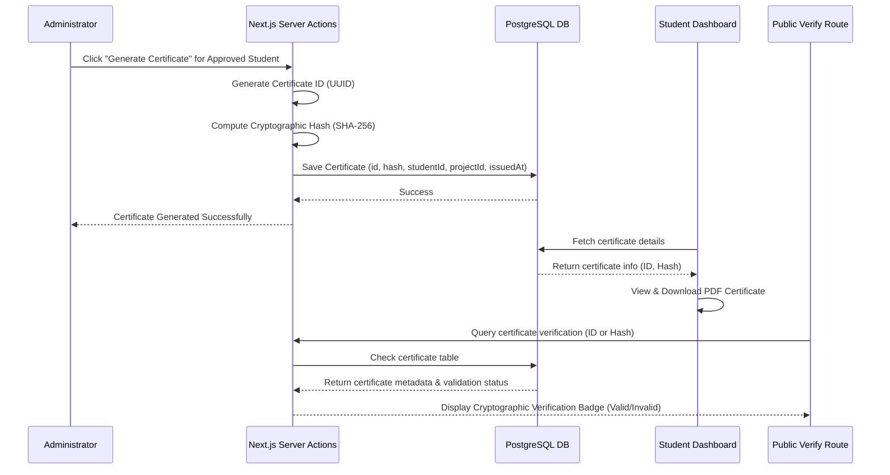

Status: Approved

Version: 1.0

Depends On:
- docs/01_Project_Constitution.md
- docs/02_Documentation_Index.md

Blocks:
- docs/Architecture/04_UX_Architecture.md

Owner:
Lead Architect

---

# 03 - Product Architecture

## 1. Document Purpose
This document defines the high-level product architecture, user roles, state-flow mappings, and key functional flows of the SkillBridge Internship Management Portal (IMP).

## 2. Core User Flows

### 2.1 Student Registration & Onboarding
Users sign up through `/register` or log in through `/login`. Next.js Server Actions validate the request and perform password hashing (via bcrypt) before committing user records to PostgreSQL. The Next.js Middleware intercepts request routes and validates session JWTs to enforce Role-Based Access Control (RBAC) redirect mappings:
- **Student** -> `/dashboard/student`
- **Mentor** -> `/dashboard/mentor`
- **Administrator** -> `/dashboard/admin`

### 2.2 Project Allocation & Tracking
Once registered, students remain in an `UNASSIGNED` state until an Administrator assigns them a project template. Assigned projects display as structured task lists with checkboxes. The student's progress updates in real-time as they complete and toggle task items.

### 2.3 Mentor Submission Review Lifecycle
When a student completes all tasks and inputs both their GitHub repository and live deployment URLs, their status transitions to `SUBMITTED`. The submission is pushed to the assigned Mentor's dashboard queue. Mentors audit the source code and deployment directly, providing structured comments in a feedback editor before issuing a final decision:
- **Approve**: Transition student status to `APPROVED`, unlocking certificate generation.
- **Reject**: Transition student status to `REJECTED`, allowing resubmission.

### 2.4 Certificate Issuance & Verification
Once marked as `APPROVED` by their mentor, the student appears in the Admin dashboard. The administrator clicks "Generate Certificate". The platform generates a unique certificate record containing:
1. A unique UUID (Certificate ID).
2. A cryptographically verifiable signature hash derived using SHA-256 over the student's name, project details, issue date, and a private environment secret.

Students can download their certificate as a PDF directly from their dashboard. Public users (e.g. recruiters) can query `/verify?id=[id]` to inspect and verify the authenticity of the certificate.

## 3. Product Integration & Boundaries
The platform operates as a self-contained web app using PostgreSQL for transactional data state persistence. The Next.js framework serves client bundles (HTML, CSS, React components) and runs backend Server Actions / API endpoint route handlers inside Serverless functions on Vercel. External integrations are strictly limited to repository references (GitHub) and external deployment URL verification.

## 4. Requirements Traceability

| ID | PDF / Constitution Requirement | Proposed Design Specification | Status |
|:---|:---|:---|:---:|
| **REQ-01** | Student Role | Profile dashboard, project tracking checklist, submit URLs, view feedback | ✅ Cover |
| **REQ-02** | Mentor Role | Audit assigned students, submission queue, review actions, feedback editor | ✅ Cover |
| **REQ-03** | Administrator Role | Manage students/projects, analytics, certificate generation | ✅ Cover |
| **REQ-04** | Authentication System | Email/Password credentials login/register, Next.js RBAC middleware routing | ✅ Cover |
| **REQ-05** | Student Dashboard | Checklists, links submission, project details view, feedback status view | ✅ Cover |
| **REQ-06** | Mentor Dashboard | Active queues, detail cards, reject/approve actions, feedback editor | ✅ Cover |
| **REQ-07** | Admin Dashboard | Student and Project CRUD tables, Certificate management interface | ✅ Cover |
| **REQ-08** | Analytics Module | Aggregations (Active students, completions, review counts, percent metrics) | ✅ Cover |
| **REQ-09** | Certificate Generation | UUID index, cryptographic hash verification check, downloadable PDF | ✅ Cover |
| **REQ-10** | Core Tech Stack | Next.js, React, TypeScript, Tailwind CSS, Prisma ORM, PostgreSQL, Vercel | ✅ Cover |

## 5. Architecture Review Checklist
- [x] Mapped all three mandatory roles (Student, Mentor, Administrator)
- [x] Described user registration & login flows
- [x] Mapped submission and approval state flows
- [x] Mapped certificate generation and lookup verification flows
- [x] Confirms to Project Constitution boundaries

