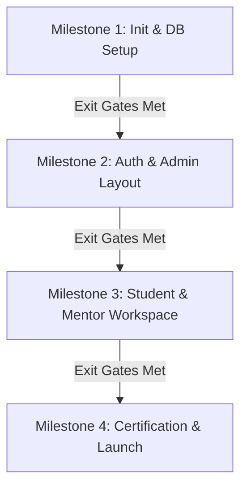

Status: Approved

Version: 1.0

Depends On:
- docs/Design/13_Accessibility_Guidelines.md

Blocks:
- docs/Planning/15_Implementation_Roadmap.md

Owner:
Lead Architect

---

# 14 - Project Phases

## 1. Document Purpose
This document establishes the chronological milestones, entry/exit gating criteria, and phase boundaries for the development and release lifecycle of the SkillBridge Internship Management Portal (IMP).

---

## 2. Chronological Milestones Layout

The development workflow is divided into four distinct milestones. No milestone may begin until all exit gates of the preceding milestone are formally verified.

### 2.1 Milestone 1: Base Core Workspace Setup
- **Scope**: Repository structure, Next.js framework configuration, Tailwind CSS styling tokens base configuration, Prisma schema declaration, and initial PostgreSQL migrations.
- **Entry Gates**: 
  - Approved Database Design ([08_Database_Architecture.md](file:///home/ntirth005/Documents/IMP/docs/Architecture/08_Database_Architecture.md)) and API Design ([09_API_Architecture.md](file:///home/ntirth005/Documents/IMP/docs/Architecture/09_API_Architecture.md)).
- **Exit Gates**:
  - Code compiles successfully without TypeScript warnings.
  - `npx prisma db push` or migrations run cleanly against local PostgreSQL.
  - Design system tokens declared in `src/app/globals.css`.
  - Empty app router folder structure scaffolded.

### 2.2 Milestone 2: Authentication System & Admin Layout
- **Scope**: JWT session cookie creation, Edge middleware RBAC routes enforcement, credentials registration/login pages, and the Administrator dashboard (analytics, user directory CRUD, project templates CRUD).
- **Entry Gates**: 
  - Milestone 1 exit gates verified.
- **Exit Gates**:
  - Middleware intercepts and redirects unauthenticated users or users matching incorrect role JWTs.
  - Admin can create, read, update, and delete Students and Mentors.
  - Admin can CRUD project templates containing JSON checklist configurations.

### 2.3 Milestone 3: Student Portal & Mentor Review Workspace
- **Scope**: Student project detail view, interactive checklists (with optimistic UI and progress updates), git/deployment URL submit fields, Mentor queue review table, student details inspector, and review decision/comment actions.
- **Entry Gates**: 
  - Milestone 2 exit gates verified.
- **Exit Gates**:
  - Toggling checklist items recalculates and updates `StudentProfile.progress` in the database.
  - Submitting deliverables checks Zod validations and transitions student status to `SUBMITTED`.
  - Mentor reviews commit to `Feedback` table and transition status to `APPROVED` or `REJECTED`.

### 2.4 Milestone 4: Cryptographic Certificate Engine & Launch
- **Scope**: HMAC-SHA256 signature generator, Admin certificate issuance ledger, PDF export, and the public verification lookup tool (`/verify` and `/verify/[certId]`).
- **Entry Gates**: 
  - Milestone 3 exit gates verified.
- **Exit Gates**:
  - Certificates generate successfully for `APPROVED` students, creating verifiable UUID records and HMAC-SHA256 checksum strings.
  - Public route returns authentic verification status or structured 404 responses.
  - PDF downloads are fully functional.

---

## 3. Transition Gating Checklists

To move between milestones during development, a pull request must satisfy the following checklist:

1. **Compilation Check**: `npm run build` succeeds with zero errors or warnings.
2. **Linting Check**: `npm run lint` passes with no issues.
3. **Database Integrity**: Prisma schema is formatted, and database migrations are fully synchronized.
4. **Git Policy Check**: All commit messages conform strictly to the Conventional Commits specification outlined in the Project Constitution.
5. **Accessibility Check**: Interactive elements contain visible focus rings, pass screen reader keyboard focus checks, and meet contrast requirements.
6. **Responsive Layouts**: Layouts are tested across mobile, tablet, and desktop viewports.

---

## 4. Requirements Traceability

| ID | Specification Reference | Milestone Mapping | Exit Verification Criteria | Status |
|:---|:---|:---|:---|:---:|
| **PH-REQ-01** | Base Configurations | Milestone 1 | Compile checks and package json audits | ✅ Covered |
| **PH-REQ-02** | Authentication Setup | Milestone 2 | JWT session cookies and Edge middleware redirect checks | ✅ Covered |
| **PH-REQ-03** | Dashboards Execution | Milestone 3 | Checklist updates, submission changes, mentor audits | ✅ Covered |
| **PH-REQ-04** | Verifiable Credentials| Milestone 4 | HMAC signatures verified on public API lookup routes | ✅ Covered |

---

## 5. Review Checklist
- [x] Phases align with `CURRENT_PHASE.md` tracking (4 milestones mapped)
- [x] Gating checklists enforce documentation-first principles (exit/entry check layers specified)
- [x] Milestones cover all six mandatory modules (Auth, dashboards, analytics, certificates covered)
- [x] Deliverables timeline keeps scheduling reasonable (sequential dependency checkpoints)
