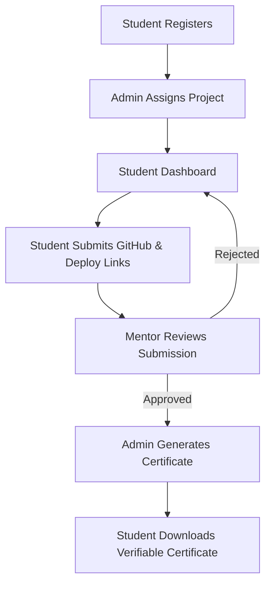
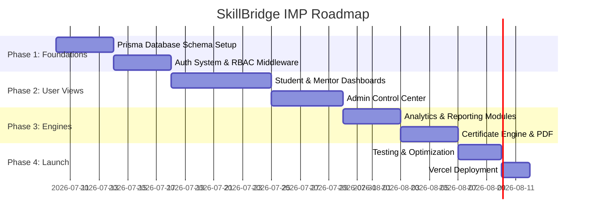

# Product Design & UX Architecture Specification
## SkillBridge Internship Management Portal (IMP)

---

## 1. Executive Summary
The **SkillBridge Internship Management Portal (IMP)** is a full-stack enterprise-grade web application designed to streamline internship programs. The portal bridges three distinct roles: **Students**, **Mentors**, and **Administrators**. It facilitates project distribution, task submission tracking, mentor feedback loops, real-time analytics, and automated certificate generation. 

Designed for scalability, premium usability, and modern aesthetics, the IMP ensures a transparent and highly efficient workflow for all stakeholders. The implementation will follow a modern design system using **Next.js, React, TypeScript, Tailwind CSS, PostgreSQL, and Prisma ORM**, deployed seamlessly on **Vercel**.

---

## 2. Requirement Analysis
Based on the authoritative *SkillBridge Internship Program* specification, the system mandates the following requirements and constraints:

### 2.1 Role Constraints
- **Student**: Manages profiles, views assigned projects, tracks progress, submits GitHub repositories, submits live deployment links, and reviews mentor feedback.
- **Mentor**: Reviews assigned students, reviews submissions, approves/rejects projects, and provides structured feedback.
- **Administrator**: Exercises full platform management, manages student accounts, designs and assigns projects, monitors platform-wide progress, reviews aggregate analytics, and generates/verifies completion certificates.

### 2.2 Core Modules
1. **Authentication System**: Secure user registration, login, role-based access control (RBAC).
2. **Student Dashboard**: Interface for tracking assignments, submitting deliverables, and reviewing status/feedback.
3. **Mentor Dashboard**: Interface for student progress audits, submission code reviews, and feedback submission.
4. **Admin Dashboard**: Control center for management, configurations, and administrative tools.
5. **Analytics Module**: Dynamic reporting of student engagement, completion rates, and queue statistics.
6. **Certificate Generation**: Cryptographically verifiable and downloadable completion certificates.

---

## 3. Product Vision
The product vision for the SkillBridge IMP is to replace manual progress tracking and email-based project submissions with a central, automated work engine.



### Core Value Propositions
- **For Students**: A single workspace showing exactly what is required, real-time feedback, and a clean path to earning their completion certificate.
- **For Mentors**: An streamlined review queue that replaces scattered chat messages and email chains.
- **For Admins**: High-level visibility into cohort health, quick project provisioning, and automatic verification systems.

---

## 4. UX Principles
To achieve a premium, state-of-the-art interface that wows users, the system adopts the following principles:

1. **Aesthetic Consistency**: Utilizing a customized dark-mode first design system (deep slates, vibrant accents, glassmorphic overlays) to convey a professional, modern environment.
2. **Contextual Disclosure**: Only displaying tools and information relevant to the current user's role and task to reduce cognitive load.
3. **Visual Feedback & Micro-interactions**: Smooth transitions (0.2s ease-in-out), clear state changes on action items, and real-time validation feedback.
4. **Focus on Typography**: Strict visual hierarchy using clean, highly readable font families (Inter and Outfit) with calibrated scale and line-heights.

---

## 5. Information Architecture
The platform is organized into three distinct workspace directories mapped by role permissions.

```mermaid
graph TD
    Root[/] --> Auth[Auth: Login/Register]
    Root --> StudentDash[Student Dashboard]
    Root --> MentorDash[Mentor Dashboard]
    Root --> AdminDash[Admin Dashboard]
    
    StudentDash --> StudProj[Project View]
    StudentDash --> StudSubmit[Submit Portal]
    StudentDash --> StudProfile[Profile Settings]
    
    MentorDash --> MentQueue[Submission Queue]
    MentorDash --> MentReview[Review Workspace]
    
    AdminDash --> AdminStud[Student Management]
    AdminDash --> AdminProj[Project Management]
    AdminDash --> AdminAnalytics[Cohort Analytics]
    AdminDash --> AdminCert[Certificate Panel]
```

### Entity Relationship Model (Database Design)
The database structure utilizes PostgreSQL, accessed via Prisma ORM:

```prisma
datasource db {
  provider = "postgresql"
  url      = env("DATABASE_URL")
}

generator client {
  provider = "prisma-client-js"
}

enum Role {
  STUDENT
  MENTOR
  ADMIN
}

enum ProjectStatus {
  NOT_STARTED
  IN_PROGRESS
  SUBMITTED
  APPROVED
  REJECTED
}

model User {
  id            String         @id @default(uuid())
  email         String         @unique
  passwordHash  String
  name          String
  role          Role           @default(STUDENT)
  createdAt     DateTime       @default(now())
  updatedAt     DateTime       @updatedAt
  profile       Profile?
  
  // Relations for Students
  assignedProjId String?
  assignedProj   Project?      @relation("StudentProject", fields: [assignedProjId], references: [id])
  submissions    Submission[]
  certificate    Certificate?
  
  // Relations for Mentors
  mentorStudents User[]        @relation("MentorStudents")
  mentorId      String?
  mentor        User?          @relation("MentorStudents", fields: [mentorId], references: [id])
}

model Profile {
  id          String   @id @default(uuid())
  userId      String   @unique
  user        User     @relation(fields: [userId], references: [id], onDelete: Cascade)
  githubUrl   String?
  linkedinUrl String?
  avatarUrl   String?
  skills      String[]
  bio         String?
}

model Project {
  id          String         @id @default(uuid())
  title       String
  description String
  requirements String[]
  createdAt   DateTime       @default(now())
  updatedAt   DateTime       @updatedAt
  students    User[]         @relation("StudentProject")
}

model Submission {
  id            String        @id @default(uuid())
  studentId     String
  student       User          @relation(fields: [studentId], references: [id], onDelete: Cascade)
  githubRepoUrl String
  liveDeployUrl String
  status        ProjectStatus @default(SUBMITTED)
  feedback      String?
  reviewedAt    DateTime?
  createdAt     DateTime      @default(now())
}

model Certificate {
  id            String   @id @default(uuid())
  studentId     String   @unique
  student       User     @relation(fields: [studentId], references: [id], onDelete: Cascade)
  certificateId String   @unique // Cryptographic Hash or custom format
  issuedAt      DateTime @default(now())
  hashSignature String   @unique
}
```

---

## 6. Navigation Architecture
Global navigation features a clean, responsive layout structure:

### 6.1 Top Bar (Global Header)
- **Brand Logo**: SkillBridge IMP branding.
- **Search Command Palette**: Triggers modal for navigation and directory search.
- **Notifications Hub**: Alerts for project assignment updates, submission feedback, or review requests.
- **User Settings Dropdown**: Profile access, layout preferences, and logout.

### 6.2 Sidebar (Role-Specific)
- **Student Navigation**: 
  - Overview / Progress Tracker
  - My Project Description
  - Submission Panel
  - Profile Settings
- **Mentor Navigation**:
  - Review Queue (Active submissions requiring action)
  - Student Directory (List of all assigned students)
  - Archive (Past approvals/rejections)
- **Admin Navigation**:
  - Dashboard & Platform Analytics
  - User Directory (Manage Students/Mentors)
  - Project Library (Create, edit, assign projects)
  - Certificate Control (Issuance queue and template configuration)

---

## 7. Role-Based Experience

### 7.1 Student Experience
The student experience focuses on clarity of deadlines, requirements, and progressive submission interfaces.
- **Home Dashboard**: Displays a visual progress bar (e.g. `In Progress` -> `Submitted` -> `Under Review` -> `Approved`), the assigned project details, and any feedback received from the mentor.
- **Interactive Submit Portal**: A clean, single-form interface allowing the student to input their GitHub Repository link and live deployment URL. Built-in validation checks (e.g., matching github.com domain pattern) prevent erroneous submissions.
- **Feedback Hub**: Visual notifications highlighting mentor critiques, displaying comments clearly alongside status revisions.

### 7.2 Mentor Experience
Mentors require an interface optimized for prompt code verification and communication.
- **Review Inbox**: A priority list of pending student submissions sorted by submission age.
- **Code Audit Pane**: Side-by-side display of the student's submission metadata, live links, and editable text boxes for structured feedback.
- **Decision Engine**: High-visibility "Approve" (success green) and "Request Revision" (danger red) actions to update student status instantaneously.

### 7.3 Admin Experience
Administrators need high-level tools to oversee operations and register data.
- **Analytics Visualizer**: Displays cohort summaries (Total students, active, completed, approval rates).
- **Project Provisioner**: Form interface for inputting project titles, descriptions, and dynamic checklist items (rendered as dynamic markdown lists for students).
- **Certificate Issuance Center**: A table containing approved students missing certificates. Click-to-generate triggers server-side signature creation, emailing the secure PDF/verification link to the student.

---

## 8. Design System
The design system ensures a unified, visually gorgeous experience across all portals.

### 8.1 Color Palette
An sophisticated, high-contrast palette supporting dark mode by default:
- **Base Dark (Slate)**: `hsl(222, 47%, 11%)` (Core background)
- **Card Dark (Slate)**: `hsl(217, 33%, 17%)` (Dashboard widgets/containers)
- **Primary Accent (Indigo)**: `hsl(250, 89%, 65%)` (Interactive triggers, active sidebar elements)
- **Success Accent (Emerald)**: `hsl(142, 71%, 45%)` (Approvals, completed status, certificates)
- **Warning Accent (Amber)**: `hsl(38, 92%, 50%)` (Pending reviews)
- **Text Primary (Snow)**: `hsl(210, 40%, 98%)` (High-contrast body text)
- **Text Secondary (Muted)**: `hsl(215, 20%, 65%)` (Subtitles, layout hints)

### 8.2 Typography
- **Primary Interface Font**: `Inter` (Sans-serif) for high legibility in dense lists and controls.
- **Headings Font**: `Outfit` (Sans-serif) for professional, premium branding.
- **Visual Scale**:
  - `Display 1`: 36px (Outfit, Bold)
  - `Heading 1`: 24px (Outfit, Semi-Bold)
  - `Subheading`: 18px (Inter, Medium)
  - `Body`: 14px (Inter, Regular)
  - `Muted / Caption`: 12px (Inter, Light)

---

## 9. Component Inventory
The UI is broken down into structured, highly-reusable React components:

### 9.1 Global Elements
- `Card`: Container utilizing glassmorphism overlays with border highlights.
- `Badge`: Tiny status indicator utilizing semantic variants (`success`, `warning`, `error`, `info`).
- `Button`: Multiple states (solid, outline, ghost) handling loading spinner overlays.
- `Input`: Border transition states styling focus rings using Primary Accent colors.

### 9.2 Specialized Widgets
- `ProgressGauge`: Visual ring showing completion percentage.
- `SubmissionRow`: Table component for list-views containing links, date-stamps, and action triggers.
- `AnalyticsCard`: Metric card illustrating numerical values, growth vectors, and iconography.
- `CertificateFrame`: Premium layout engine to display and download cryptographic certificates.

---

## 10. Frontend Architecture
The system utilizes a Next.js App Router configuration for efficient routing and Server-Side Rendering (SSR).

```
IMP/
├── prisma/
│   └── schema.prisma         # Prisma Database Models
├── src/
│   ├── app/                  # Next.js App Router Pages
│   │   ├── layout.tsx        # Base Document Shell
│   │   ├── page.tsx          # Public Landing & Auth Redirect
│   │   ├── auth/             # Login / Register
│   │   └── dashboard/        # Authenticated Layouts
│   │       ├── student/      # Student Dashboard Views
│   │       ├── mentor/       # Mentor Action Panels
│   │       └── admin/        # Platform Control Center
│   ├── components/           # Shared UI Layouts & Components
│   │   ├── ui/               # Base Elements (Buttons, Inputs)
│   │   └── dashboard/        # Widget Inventories
│   ├── lib/                  # Utilities (db connection, auth checks)
│   │   ├── db.ts             # Prisma Client Instantiation
│   │   └── auth.ts           # JWT / Session validations
│   └── types/                # TypeScript Interfaces
```

### State Management & Server Actions
- **Server State**: Managed via Next.js Server Actions to execute secure DB mutations directly from server-side handlers, removing the need for auxiliary fetch APIs.
- **Client State**: Light client-side global states (e.g. command palette visibility, layout shifts) are managed using React Context.

---

## 11. Responsive Strategy
The application adapts dynamically to various viewports:
- **Mobile (< 768px)**: Sidebars fold into a slide-out hamburger menu drawer. Heavy tables convert into stackable card grids. Padding scales down to 16px.
- **Tablet (768px - 1024px)**: Sidebar minimizes to icon-only buttons. Card grids transition to 2 columns.
- **Desktop (1024px+)**: Standard sidebar expanded layout. Full tables with multi-column sorting. 3 to 4 column dashboard layouts.

---

## 12. Accessibility (a11y)
The design strictly follows WCAG 2.1 AA guidelines:
- **Color Contrast**: Main body text to background contrast is maintained above a 4.5:1 ratio.
- **Keyboard Access**: Focus states are clearly outlined on interactive controls. Modal overlays trap focus correctly inside active dialog blocks.
- **Semantic HTML**: Navigation panels use `<nav>`, sidebars use `<aside>`, dashboard grids use `<main>`, and data arrays use `<table>`.
- **ARIA Elements**: Screen reader accessibility is supported via standard labels (`aria-label`, `aria-describedby`, and `aria-expanded`).

---

## 13. Performance Strategy
To maintain instantaneous response speeds across large cohorts, the system will apply:
- **Static vs Dynamic Generation**: Static site generation (SSG) for base login structures, while using server-side rendering (SSR) with dynamic caching protocols for real-time dashboards.
- **Prisma Connection Pooling**: Direct integration with pgBouncer for high-frequency database operations.
- **Lazy Loading**: Code splitting using `next/dynamic` to load heavy certificate generation components only when accessed by the user.

---

## 14. Implementation Phases



---

## 15. Risk Analysis
- **Security Vulnerability: Privilege Escalation**
  - *Risk*: Students altering submission records of others or accessing admin routes.
  - *Mitigation*: Implementation of server-side middleware verifying the user's role before processing Server Actions.
- **Database Strain during Submission Windows**
  - *Risk*: DB CPU exhaustion due to synchronous reads on analytics dashboards during mass student submission events.
  - *Mitigation*: Indexing columns `studentId` and `status` in PostgreSQL; caching analytics queries using memory stores.

---

## 16. Future Enhancements (Optional)
The following enhancements are strictly decoupled from core features:
- **Optional Future Enhancement: AI Assistant**
  - A contextual sidebar offering AI-powered code auditing hints for student project submissions before they send them to their mentor.
- **Optional Future Enhancement: AI Project Matcher**
  - Semantic analyzer mapping student skills in their profile to available project requirements to suggest optimal assignments.
- **Optional Future Enhancement: Custom Dashboard Docking Grid**
  - Allowing admins to drag-and-drop different widgets (Submission queue, sign-up lists) to custom layout layouts.

---

## 17. Requirement Traceability Matrix

| PDF Requirement | Proposed Solution | Status |
| :--- | :--- | :---: |
| **Authentication System** | Secure login, registration routes (`/auth`) and RBAC server middleware verifying tokens. | ✅ |
| **Role-Based Access Control** | Prisma schema defining `STUDENT`, `MENTOR`, and `ADMIN` roles routing views based on session context. | ✅ |
| **Student Profile Management** | Edit-form in Student Portal writing profile links (GitHub, LinkedIn) to the `Profile` database model. | ✅ |
| **View Assigned Project** | Live project detail block displaying instructions, files, and milestones fetched from database. | ✅ |
| **Project Progress Tracking** | A visual multi-step progress bar updating automatically as status transitions occur. | ✅ |
| **Submit GitHub Repository** | Clean submit modal in Student Dashboard taking GitHub URL inputs, performing schema validation checks. | ✅ |
| **Submit Deployment Link** | Deployment URL field validation checks, storing links securely alongside GitHub repository records. | ✅ |
| **View Feedback** | Comment view in Student Dashboard displaying structured text comments left by mentors. | ✅ |
| **View Assigned Students** | Mentor dashboard table displaying students mapped to the current mentor's unique ID. | ✅ |
| **Review Submissions** | A centralized queue view displaying pending submissions with live link redirects. | ✅ |
| **Approve / Reject Projects** | Double-action triggers on submissions updating submission state to `APPROVED` or `REJECTED`. | ✅ |
| **Provide Feedback** | Text comment editor embedded directly in the Mentor submission review interface. | ✅ |
| **Admin Student Management** | Student control table in Admin Portal enabling user additions, edits, and deletions. | ✅ |
| **Admin Project Management** | Library views allowing admins to create new projects and assign them to students. | ✅ |
| **Admin Track Progress** | Platform-wide tracking logs highlighting student cohort state across all projects. | ✅ |
| **Admin Review Analytics** | Graph-driven analytics board tracking completion metrics and outstanding queues. | ✅ |
| **Admin Generate Certificates** | Generate button automatically rendering cryptographic signatures for approved students. | ✅ |
| **Certificate ID** | Unique certificate identifiers mapped directly to individual students on approval. | ✅ |
| **Downloadable Certificate** | Client-side export functionality downloading high-fidelity PDF certificate layout designs. | ✅ |
| **Completion Verification** | Publicly accessible lookup view verifying certificate validity via cryptographic hash queries. | ✅ |
| **Next.js Stack** | App router structural foundation routing API logs and handling layouts. | ✅ |
| **React Stack** | Dynamic user dashboard interface components driving dashboard updates. | ✅ |
| **TypeScript Stack** | Static typing schemas across database responses and prop layouts. | ✅ |
| **Tailwind CSS** | Styling using dark-slate gradients, spacing, and glassmorphic configurations. | ✅ |
| **Prisma ORM** | Schema migration files connecting code actions to PostgreSQL models. | ✅ |
| **PostgreSQL Database** | Relational tables persisting users, submissions, profiles, and certificates. | ✅ |
| **Vercel Deployment** | Serverless hosting deploying the application environment securely. | ✅ |

---
*End of Single Source of Truth Specification Document.*
