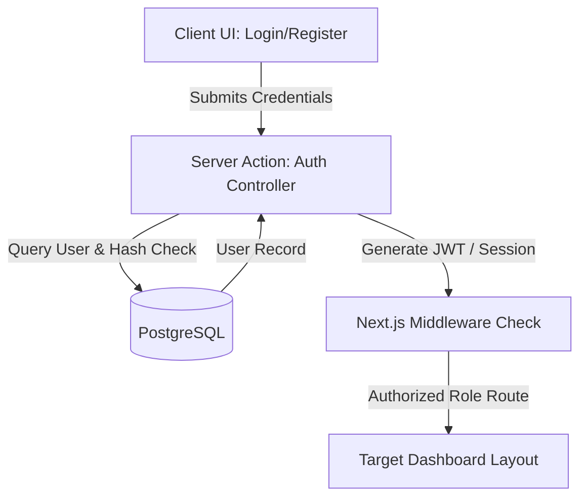
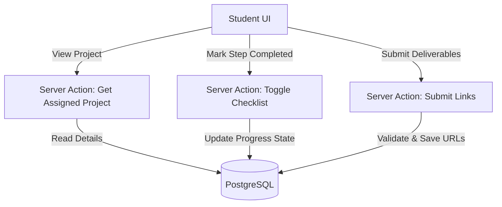
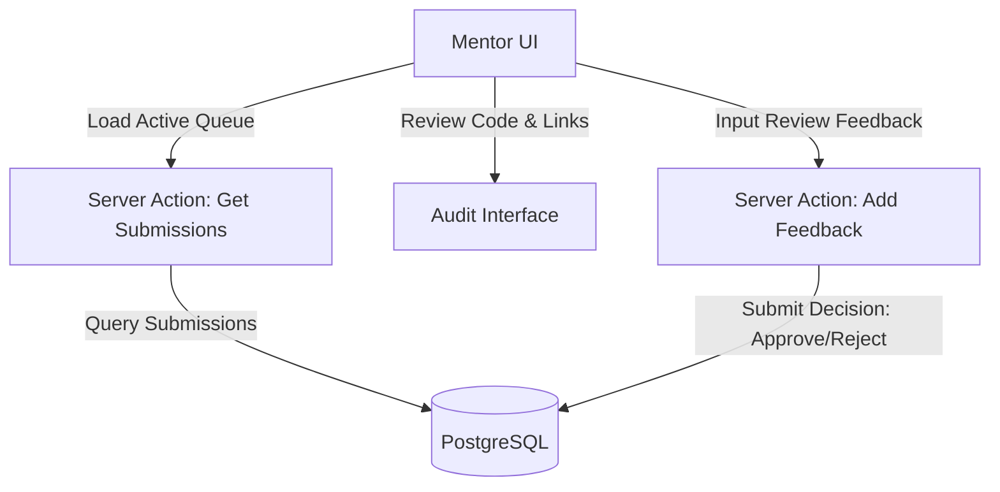
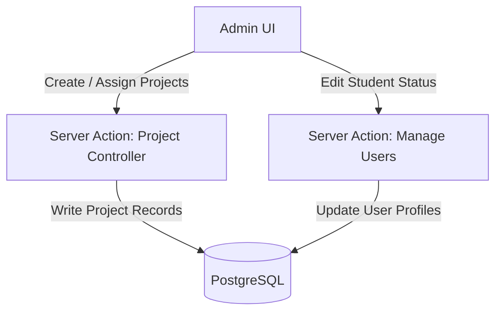
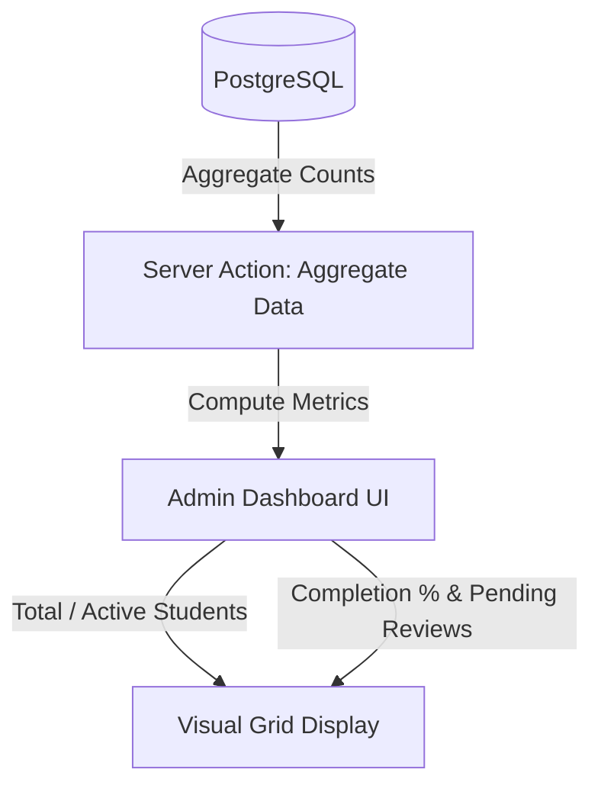
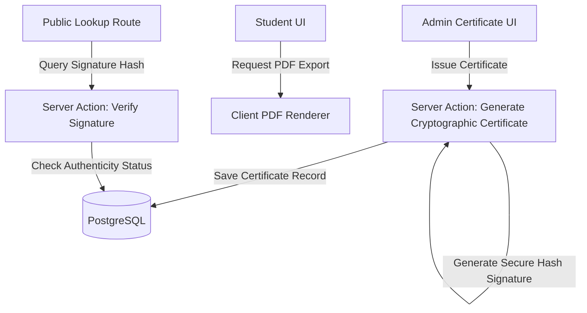

# SkillBridge Internship Management Portal (IMP)

Welcome to the central repository for the **SkillBridge Internship Management Portal (IMP)**. This platform coordinates project distribution, student progress tracking, submission reviews, and cryptographic certificate generation.

---

## 1. Project Overview & Tech Stack
The SkillBridge IMP is a secure, full-stack application built to host and manage cohort internships. 

### Technology Stack (Immutable)
*   **Frontend**: Next.js (App Router), React, TypeScript, Tailwind CSS
*   **Database**: PostgreSQL
*   **ORM**: Prisma ORM
*   **Hosting**: Vercel

### Current Project Status
*   **Active Phase**: Phase 8: API Design (🚧 Active)
*   **Last Completed Phase**: Phase 7: Database Design (✅ Approved)
*   **Live Phase Log**: Refer to [CURRENT_PHASE.md](file:///home/ntirth005/Documents/IMP/docs/CURRENT_PHASE.md) for up-to-date documentation gating status.

---

## 2. Documentation-First Methodology
This repository strictly enforces a **documentation-first workflow**. Implementation code and UI mockups must not be generated until the preceding architectural specifications are reviewed and approved.

### Documentation Workflow Stages
1.  **START_HERE**: All AI assistants begin by reading `docs/START_HERE.md`.
2.  **Constitution Alignment**: All designs must align with `docs/01_Project_Constitution.md`.
3.  **Sequential Drafting**: Placeholder files under `Architecture/`, `Design/`, `Planning/`, and `Development/` are generated one-by-one, pausing for approval before unlocking the next.
4.  **Active Stage Tracking**: Current status is logged and monitored in `docs/CURRENT_PHASE.md`.

---

## 3. Repository Structure & Hierarchy

```
docs/
├── 00_Project_Requirements.pdf              # Immutable requirements PDF
├── 01_Project_Constitution.md               # Governs roles, stack, and rules
├── 02_Documentation_Index.md                # Tracker and index table
├── START_HERE.md                            # Entry point for AI chats
├── CURRENT_PHASE.md                         # Live project phase log
├── CHANGELOG.md                             # Governance changes log
├── README.md                                # This document
│
├── Architecture/                            # Active drafting phase (03-08 approved)
│   ├── 03_Product_Architecture.md
│   ├── 04_UX_Architecture.md
│   ├── 05_Information_Architecture.md
│   ├── 06_Frontend_Architecture.md
│   ├── 07_Backend_Architecture.md
│   ├── 08_Database_Architecture.md
│   └── 09_API_Architecture.md
│
├── Design/                                  # Placeholder design files
│   ├── 10_Design_System.md
│   ├── 11_Component_Library.md
│   ├── 12_Interaction_Guidelines.md
│   └── 13_Accessibility_Guidelines.md
│
├── Planning/                                # Placeholder project logs
│   ├── 14_Project_Phases.md
│   ├── 15_Implementation_Roadmap.md
│   ├── 16_Testing_Strategy.md
│   └── 17_Deployment_Strategy.md
│
├── Development/                             # Placeholder standard rules
│   ├── 18_Coding_Standards.md
│   ├── 19_Git_Workflow.md
│   ├── 20_Project_Structure.md
│   └── 21_Definition_of_Done.md
│
├── Decision-Records/                        # Architecture Decision Records
│   └── ADR-000-Template.md                  # Standard template for ADRs
│
└── Templates/                               # Prompts and workspace assets
    └── SSOT_Gemini_Master_Prompt.md
```

---

## 4. How to Get Started

### For Developers (Human)
1.  Clone this repository.
2.  Navigate to the `docs/` directory and review `docs/01_Project_Constitution.md`.
3.  Consult `docs/CURRENT_PHASE.md` to see the active milestone.

### For AI Assistants
1.  Read **`docs/START_HERE.md`** first.
2.  Confirm that you have read the startup checklist before taking action.
3.  Draft/modify only the current active phase.

---

## 5. Contribution & Git Commit Policy
All contributions must adhere to the **Conventional Commits Specification** defined in the Constitution:
*   `feat(<scope>): <description>` (new features)
*   `fix(<scope>): <description>` (bug fixes)
*   `docs(<scope>): <description>` (documentation updates)
*   `refactor(<scope>): <description>` (logic refactoring)

See `docs/01_Project_Constitution.md#6-git-commit-policy-conventional-commits` for detailed guidelines.

---

## 6. Component System Designs

Below are the high-level architectural flows and system designs for each of the platform's core components.

### 6.1 Authentication System


### 6.2 Student Dashboard


### 6.3 Mentor Dashboard


### 6.4 Admin Dashboard


### 6.5 Analytics Module


### 6.6 Certificate Generation

